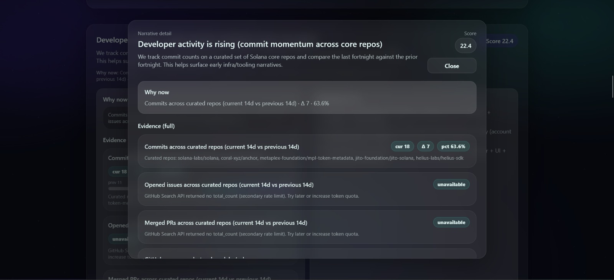

# Solana Narrative Radar (prototype)

A lightweight, explainable tool that detects early Solana ecosystem signals and converts them into:
- **Emerging narratives** (ranked)
- **Clear explanations** with evidence links
- **3–5 actionable build ideas** per narrative

Built for the Superteam Earn **Agents Only** bounty: "Develop a narrative detection and idea generation tool".

## Hosted Tool
- Dashboard: https://solana-narrative-radar-6y4kpe9rw-khadira1937s-projects.vercel.app/
- Judge artifact (styled): https://solana-narrative-radar-6y4kpe9rw-khadira1937s-projects.vercel.app/report
- Judge artifact (raw markdown): https://solana-narrative-radar-6y4kpe9rw-khadira1937s-projects.vercel.app/api/report

## Screenshots

Dashboard:



## Data Sources Used
This prototype prioritizes **signal quality, explainability, and reproducibility**.

### 1) On-chain (Solana RPC; optional Helius RPC)
- RPC URL: `SOLANA_RPC_URL` (defaults to Solana mainnet)
- Base method: `getSignaturesForAddress` for the **BPF Upgradeable Loader** program
  - `BPFLoaderUpgradeab1e11111111111111111111111`
- Signals (fortnight-over-fortnight):
  - Upgradeable Loader tx count (deploy/upgrade activity proxy)
  - **Top upgraded programs** (sampled; extracted from loader upgrade instructions, linked to Solscan)
  - **Newly-seen upgraded programs** (sampled; launch proxy vs previous window)
  - Unique fee payer count (wallet participation proxy; computed from a small tx sample)
  - Failure rate in sample (stress/instability proxy)
  - **Usage spike watchlist** (sampled signature counts for well-known programs; limit shown explicitly)

### 2) Developer + community activity (GitHub)
- GitHub REST API:
  - Repo snapshots (stars, forks, open issues, pushedAt)
  - Commit counts per repo (lightweight pagination)
- GitHub Search API (community velocity):
  - Opened issues in window (demand proxy)
  - Merged PRs in window (shipping throughput proxy)

Optional:
- `GITHUB_TOKEN` recommended to avoid rate limits.

### 3) Social signals (X / Twitter) — **official API only**
- Uses the X API v2 with `X_BEARER_TOKEN` (no scraping)
- Signals:
  - Tweet velocity across a curated KOL list (current fortnight vs previous)
  - Top posters (for evidence)

If `X_BEARER_TOKEN` is missing, X signals are disabled (the report still includes curated verification links).

### 4) Ecosystem discourse (RSS)
- Curated RSS feeds (Solana/Helius/Jito/Messari/etc.)
- Used for topic clustering + citations in the evidence panel

### Discord
- Discord ingestion is supported as a future plug-in, but requires bot access to specific servers/channels.
- This submission avoids Discord scraping and remains compliant by using official APIs + public sources.

## How signals are detected and ranked
This is a transparent scoring approach (no black box):

1. Collect signals from the sources above.
2. Convert them into simple features (counts + **fortnight deltas**).
3. Compute a narrative score using a **weighted, capped sum** of signal deltas.
4. For every narrative, show an **evidence panel** so judges can verify why it was detected.

### Fortnight windows
The tool compares:
- **Current window:** last 14 days
- **Previous window:** the 14 days before that

This is what makes narratives “emerging/accelerating” rather than static snapshots.

## Detected narratives + build ideas
The tool produces a ranked list of narratives and for each narrative:
- explanation/summary
- evidence items (metrics + citations)
- **3–5 build ideas** tied to that narrative

### Where to see the full narrative list
Because narratives are refreshed each run, the authoritative list is in:
- UI (dashboard): `/`
- UI (styled report): `/report`
- Markdown export (submission artifact): `/api/report`

These endpoints include the complete list of detected narratives and their build ideas for the current run.

### Built-in narrative families (what the tool is designed to detect)
The tool clusters discourse signals into Solana-relevant narrative families such as:
- RWAs & tokenized assets
- Stablecoins & payments
- MEV/validators/performance engineering
- Developer tooling & infra
- DeFi primitives (AMMs/perps/options)
- Token Extensions (Token-2022)
- State compression / cNFTs
- Actions/Blinks distribution
- Solana Mobile UX
- LSTs / validator economics

## Reproduce / run locally

### 1) Requirements
- Node.js 20+

### 2) Setup
```bash
cp .env.example .env
npm install
```

### 3) Run
```bash
npm run dev
```
Open http://localhost:3000

### 4) Generate a run
Click **Run analysis** in the UI, or:
```bash
curl -X POST http://localhost:3000/api/run
```

### Environment variables
- `SOLANA_RPC_URL` (optional, recommended to use Helius RPC)
- `HELIUS_API_KEY` (optional; if you use `https://rpc.helius.xyz/?api-key=...`)
- `GITHUB_TOKEN` (optional but recommended)
- `X_BEARER_TOKEN` (optional; enables official X API social velocity; if credits are depleted the app degrades gracefully)
- `SIGNALS_CACHE_MS` (optional; TTL cache for external calls, recommended 15–30 minutes in production)
- `ONCHAIN_HYDRATE` (optional; set `1` to enable small tx hydration for top-program extraction)
- `ONCHAIN_TX_SAMPLE` (optional; hydration sample size)
- `ONCHAIN_UPGRADE_SAMPLE` (optional; number of upgrade txs to sample)
- `PROGRAM_USAGE_WATCHLIST` (optional; `Label|Address,Label|Address`)
- `PROGRAM_USAGE_LIMIT` (optional; signature sample cap per program)

## Future improvements (if extended)
- True fortnight-over-fortnight deltas for on-chain metrics
- Clustering narratives automatically from signal topics
- Social signals (X lists) via allowed APIs + explicit citations
- Better on-chain features: unique wallets, program-level usage spikes, token mints, etc.
- Report export (Markdown/PDF) and scheduled runs
